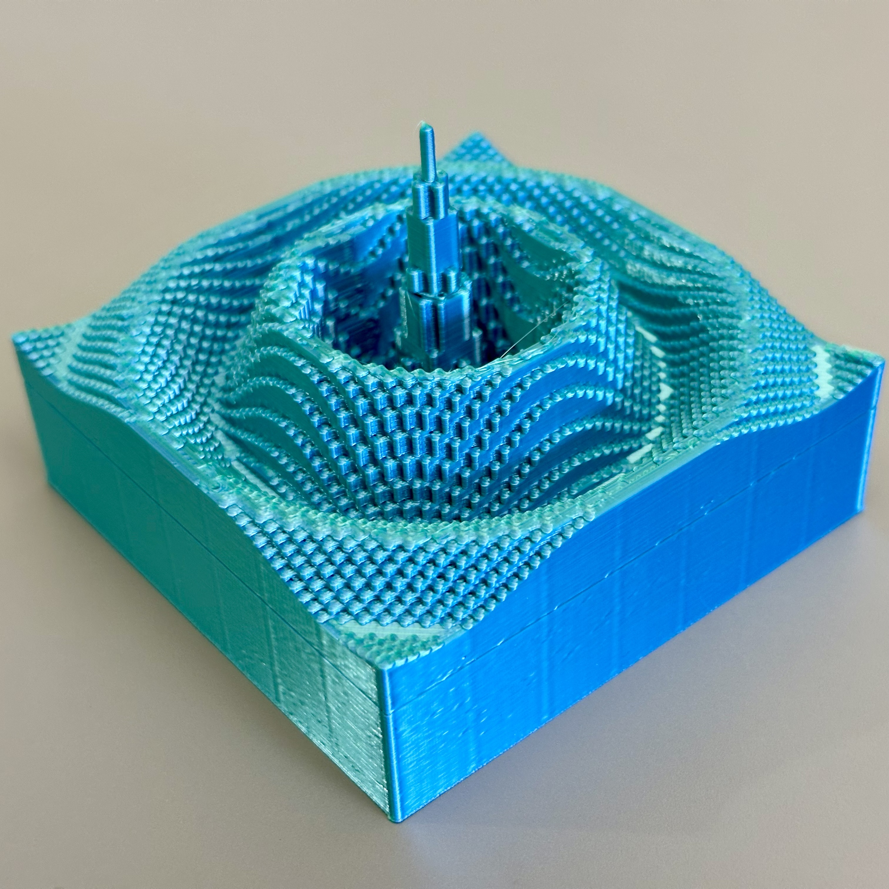
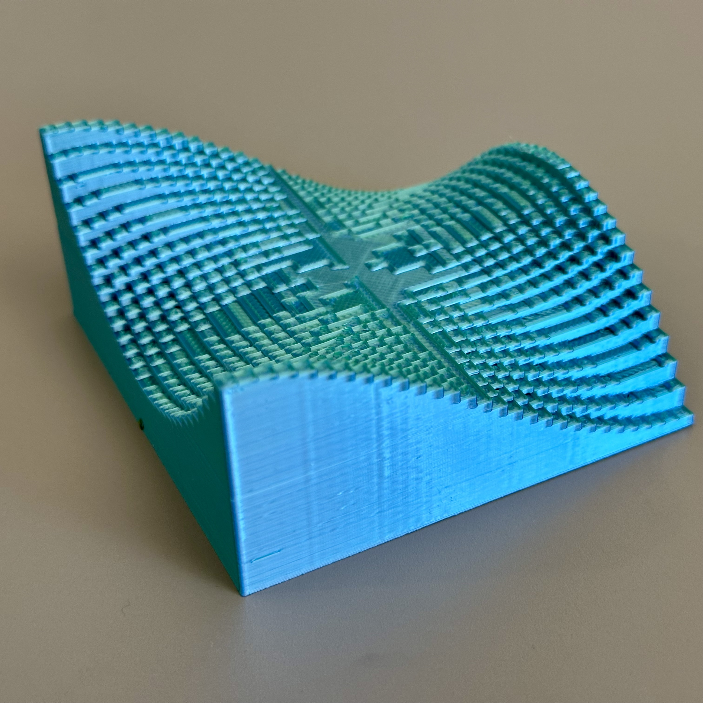

# Calculus 3D Models: Riemann Sum Approximations for Double Integrals

This repository contains an OpenSCAD file for illustrating **Riemann sum approximations** of double integrals, commonly taught in multivariable calculus courses. It also has stl files for two sample models: the monkey saddle and the sombrero function.

## Mathematical Description

- The model approximates the volume under a surface \( z = f(x, y) \) over a rectangular domain.
- The surface is approximated by rectangular prisms ("Riemann sum boxes").
- Each prism height is determined by sampling the function \( f(x, y) \) at the center of its rectangle.

  
  

## Interactive Previews

- [Monkey saddle model](MonkeySaddle.stl) (preview STL file)
- [Sombrero function model](Sombrero.stl) (preview STL file)

## How to Use

- Open the `.scad` file (`Riemann3d.scad`) in [OpenSCAD](https://openscad.org/).
- Customize parameters:
  - `f(x, y)`: Define the function you want to approximate.
  - `xmin`, `xmax`, `ymin`, `ymax`: Set the domain for \( x \) and \( y \).
  - `nx`, `ny`: Number of subdivisions in the \( x \) and \( y \) directions.
  - `verticalscalefactor`: Exaggerate vertical features for easier visualization.
  - `verticaltranslation`: Shift the surface upward to ensure positive heights.
  - `targetxwidth`: Set the final width of the printed model (in millimeters); other dimensions scale proportionally.
- Render the model.
- Export the model to STL for 3D printing or visualization.

## Files Included

- `Riemann3d.scad` — Main customizable OpenSCAD model for creating Riemann sum approximations.
- `MonkeySaddle.stl` — STL file generated using the monkey saddle example.
- `Sombrero.stl` — STL file generated using the sombrero function example.

## License

This project is licensed under the [Creative Commons Attribution-NonCommercial 4.0 International License](https://creativecommons.org/licenses/by-nc/4.0/).  
Feel free to use, modify, and share for educational or personal use, with attribution. Commercial use is not permitted.
